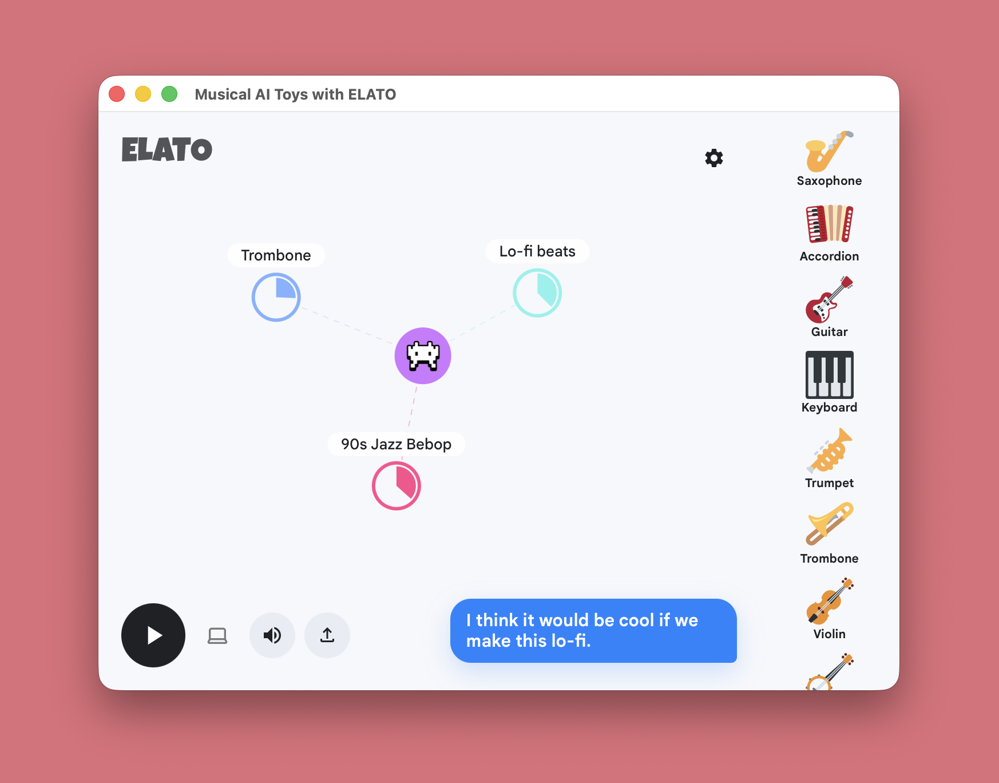

# magenta-realtime-esp32

### Mr. ESP32: a tiny device for Magenta RealTime 2.

A local-first macOS app and ESP32-S3 device that streams realtime generative music from your Mac to anywhere in your house. Touch the ESP32, say “add drums” or “make it lo-fi,” and your Mac updates the music locally using Whisper, Qwen, MLX, and Magenta RealTime 2.

[](examples/collider)
[](arduino)
[](https://magenta.withgoogle.com/mrt2)
[](LICENSE)



## Intro

This repo is built on [Magenta RealTime 2](https://magenta.withgoogle.com/mrt2), an open-weights realtime music generation model. The main app in this fork is the Collider-based macOS app:

- `examples/collider/`: native macOS app, React UI, websocket server, ESP32 audio streaming, voice-command agent.
- `arduino/`: ESP32-S3 firmware for WiFi discovery, touch interrupt, mic streaming, Opus decode, and speaker output.
- `core/`: Magenta RealTime C++ inference code used by the macOS app.

## Why mr. esp32

- **Unlimited realtime music generation**: Drag prompt bubbles around a listener puck to steer the music.
- **ESP32 speaker mode**: Stream generated audio over websocket as Opus packets to ESP32 devices you own.
- **Voice interrupt**: Touch the ESP32, speak a command, and the Mac pauses music while it listens.
- **Local STT and LLM**: Whisper transcribes locally; Qwen3.5 chooses tool calls locally.
- **Tool-call UI actions**: The agent can call `addBubble(text, nearness)` and `removeBubble(text)`.
- **No cloud required** once your models are downloaded, mr. esp32 works locally.

## Hardware Requirements

### MacBook

Realtime generation requires Apple Silicon.

- `mrt2_small` runs realtime on most Apple Silicon Macs.
- `mrt2_base` sounds better but wants a stronger Pro/Max-class machine for realtime use.

### ESP32

The firmware is currently set up for an ESP32-S3 dev board with:

- I2S microphone
- I2S speaker amp, such as MAX98357A
- touch input
- RGB/status LED
- WiFi on the same network as your Mac

See [arduino/README.md](arduino/README.md) for pin notes.

## Quick Start

### 1. Clone The Repo

```bash
git clone --recurse-submodules https://github.com/akdeb/magenta-realtime-esp32.git
cd magenta-realtime-esp32
```

If you already cloned without submodules:

```bash
git submodule update --init --recursive
```

### 2. Install Mac Dependencies

Install Homebrew packages:

```bash
brew install cmake node opus python
```

Install Python tooling and MLX voice dependencies:

```bash
python3 -m pip install --upgrade pip
python3 -m pip install mlx-whisper mlx-lm huggingface_hub
```

By default, models/resources are stored under:

```text
~/Documents/Magenta/magenta-rt-v2/
```

The app can download Magenta RT 2 shared resources and model folders from Hugging Face on first launch. If you already downloaded `mrt2_base`, place it under:

```text
~/Documents/Magenta/magenta-rt-v2/models/mrt2_base/
```

You can also pick or download a model from the app settings.

### 3. Download Local Voice Models

To have the agentic STT and LLM layer working smoothly, the app expects these Hugging Face models in your local HF cache:

- `mlx-community/whisper-base.en-mlx`
- `mlx-community/Qwen3.5-4B-MLX-4bit`

Download them once:

```bash
python3 - <<'PY'
from huggingface_hub import snapshot_download

snapshot_download("mlx-community/whisper-base.en-mlx")
snapshot_download("mlx-community/Qwen3.5-4B-MLX-4bit")
PY
```

### 4. Build And Run The macOS App

```bash
cmake . -B build
cmake --build build --target deploy_mrt2_collider -j10
open ~/Applications/"mr. esp32 by ELATO.app"
```

The deploy target builds the React UI, signs the app locally, bundles `voice_agent.py`, and copies the app to:

```text
~/Applications/mr. esp32 by ELATO.app
```

## ESP32 Setup

### 1. Install PlatformIO

If you use VS Code, install the PlatformIO extension. Or install the CLI:

```bash
python3 -m pip install platformio
```

### 2. Build And Flash Firmware

Connect the ESP32-S3 over USB, then run:

```bash
cd arduino
pio run -t upload -t monitor
```

The monitor runs at `115200`.

### 3. Connect ESP32 To WiFi

On first boot, the device exposes a WiFi setup portal. Connect to the ELATO access point, enter your WiFi credentials, and put the ESP32 on the same network as the Mac.

The Mac app advertises itself over mDNS and runs the websocket server for the ESP32. Keep the app open while powering or reconnecting the device.

## How To Use It

1. Open `mr. esp32 by ELATO.app`.
2. Wait for the model to load.
3. Click the large play button to stream music to the ESP32.
4. Click the laptop icon to enable or disable local Mac audio output.
5. Touch the ESP32 to interrupt playback.
6. Speak a command, for example:
   - "add drums to this"
   - "make it lo-fi"
   - "remove guitar"
   - "add saxophone closer"
7. The app shows your transcript, Qwen3.5 calls tools, bubbles update, and ESP32 playback resumes.

## Status Colors

The ESP32 firmware uses LED state to show what is happening:

- Green / processing: connected, waiting, or agent is thinking.
- Yellow / listening: mic is streaming to the Mac.
- Blue / speaking: ESP32 speaker is playing generated audio.

## App Controls

- Large play/pause button: ESP32 playback.
- Laptop icon: Mac/laptop audio output.
- Upload icon: load an audio prompt.
- Right instrument rail: click an instrument to add it as a music bubble.
- Settings icon: model, timing, generation, and buffer controls.

## Stack

- Music model: Magenta RealTime 2
- Native inference: C++ `magentart::core` with MLX/Metal
- UI: React, TypeScript, Vite
- Speech-to-text: `mlx-community/whisper-base.en-mlx`
- LLM agent: `mlx-community/Qwen3.5-4B-MLX-4bit`
- Transport: websocket
- ESP32 audio: Opus over websocket, decoded on-device
- Firmware: Arduino + PlatformIO

## Safety

This is an experimental local AI music toy platform. The local LLM can misunderstand speech or choose imperfect tool calls. Use it as a creative tool, supervise children, and avoid treating generated outputs as authoritative.

## Upstream Credits

This project builds on Google Magenta's [Magenta RealTime 2](https://github.com/magenta/magenta-realtime) and the open MLX ecosystem. Check out their amazing work!

## License

See [LICENSE](LICENSE).
